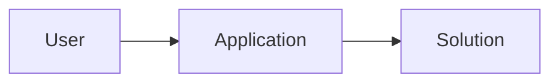
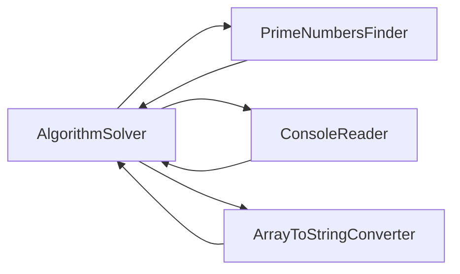

# 🚀 Level3

### 나의 생각



`User`는 1부터 입력한 숫자까지 모든 소수를 찾는 문제를 `Application` 을 통해 해결한다.<br/>


`Solution`

- 해결 추상화.<br/>
- 어떤 문제를 해결할지 모른다.<br/>

`AlgorithmSolver`

- 솔루션보다 더 구체적인 추상화<br/>



`AlgorithmSolver` 는 문제 해결을 위해 `PrimeNumbersFinder` 와 협력한다.<br/>

`PrimeNumbersFinder`

- 실제 정책이 된다.<br/>
- 소수를 찾는 역할 수행.<br/>

`ConsoleReader`

- 콘솔에 입력된 값을 읽는 역할 수행.<br/>

`ArrayToStringConverter`

- 배열을 문자열로 바꿔주는 역할 수행.<br/>

---

<br/>

### 🎯 요구 사항

3️⃣ 양의 정수를 입력받고 1부터 해당 입력값 사이의 모든 소수를 출력합니다.

- `-1`을 입력하면 프로그램을 종료합니다.
    - 즉, `-1`을 입력하기 전까지는 프로그램이 종료되지 않습니다.
- 입력된 수가 소수인지 판별하는 함수에 `메모이제이션` 기법을 적용하여 최적화합니다.
- `long` 자료형이 아닌 `int` 자료형을 사용해주세요.

### ✅ 입출력 예시

```text
== 입력 ==
숫자 입력 : [입력 1]
== 결과 ==
- [결과 1]
- [결과 2]
- [결과 ..]
- [결과 n]

== 입력 ==
숫자 입력 : [입력 1]
== 결과 ==
- [결과 1]
- [결과 2]
- [결과 ..]
- [결과 n]

== 입력 ==
숫자 입력 : [입력 2]
== 종료 ==
```

```text
== 입력 ==
숫자 입력 : 7
== 결과 ==
- 2
- 3
- 5
- 7

== 입력 ==
숫자 입력 : 13
== 결과 ==
- 2
- 3
- 5
- 7
- 11
- 13

== 입력 ==
숫자 입력 : -1
== 종료 ==
```

```text
== 입력 ==
숫자 입력 : 50
== 결과 ==
- 2
- 3
- 5
- 7
- 11
- 13
- 17
- 19
- 23
- 29
- 31
- 37
- 41
- 43
- 47

== 입력 ==
숫자 입력 : -1
== 종료 ==
```