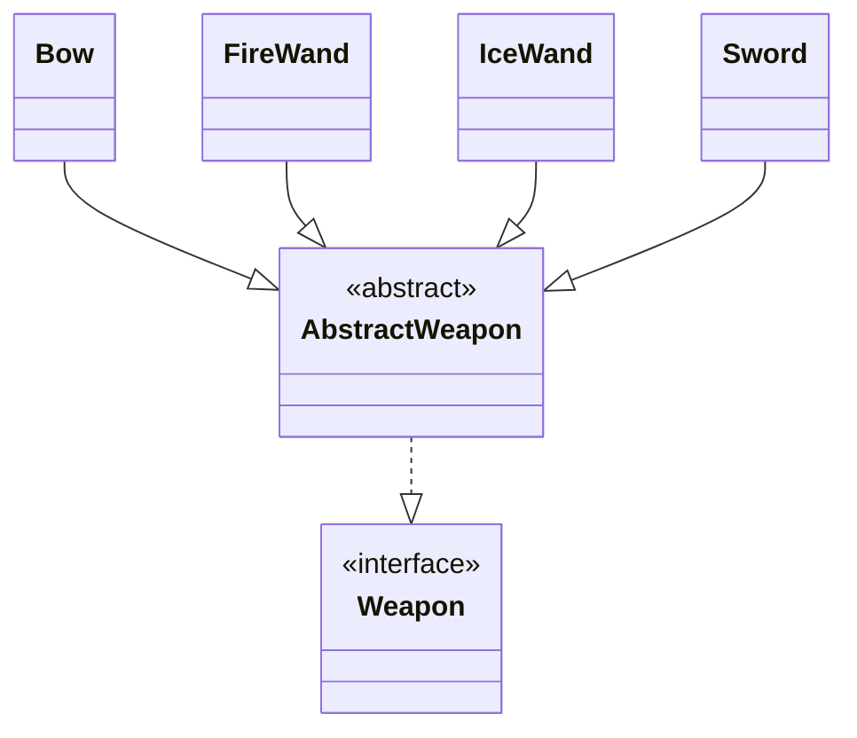
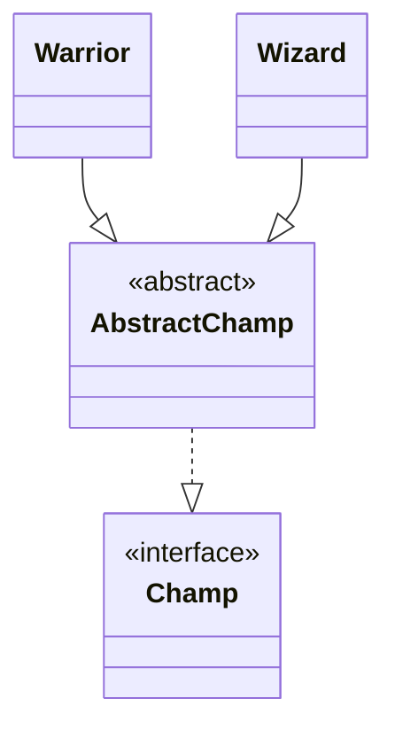

# 🚀 Level3

### 나의 생각





---

<br/>

### 🎯 요구 사항

1️⃣ 캐릭터는 무기를 교체할 수 있습니다.

- 아래 코드가 작동하도록 Main 클래스 외에 나머지 부분을 코딩해주세요.
- `전사`의 기본공격력은`10`입니다.
- `무기`추상클래스를 구현해주세요.
- 출력은 오직`System.out.println`함수만 이용해주세요.
- `System.out.println`은 오직`무기`클래스에서만 사용할 수 있습니다.

```java
public class Main {
    public static void main(String[] args) {
        전사 a전사 = new 전사();

        a전사.공격();
        // 출력 : 전사(이)가 칼(으)로 공격합니다.
        // 출력 : 데미지 : 전사 기본공격력(10) * 칼 공격력(20) => 200

        a전사.set무기(new 활());

        a전사.공격();
        // 출력 : 전사(이)가 활(으)로 공격합니다.
        // 출력 : 데미지 : 전사 기본공격력(10) * 활 공격력(100) => 1000
    }
}
```

2️⃣ 캐릭터는 무기를 교체할 수 있습니다.

- **조건: 얼음마법사의 기본 무기는 얼음지팡이 입니다.**
- 아래 코드가 작동하도록 Main 클래스 외에 나머지 부분을 코딩해주세요.
- `무기`추상클래스를 구현해주세요.
- `칼`,`활`,`불지팡이`,`얼음지팡이`클래스를 구현해주세요.
- `캐릭터`가`무기`를 사용하는`구성`으로 설계해주세요.
- 출력은 오직`System.out.println`함수만 이용해주세요.
- `System.out.println`은 오직`무기`클래스에서만 사용할 수 있습니다.
- `얼음마법사`는 초반 아이템이`얼음지팡이`라는 점만 제외하면 나머지는`마법사`와 같습니다.

```java
// Main.java
public class Main {
    public static void main(String[] args) {
        캐릭터 a캐릭터 = new 전사();

        a캐릭터.공격();
        // 출력 : 전사(이)가 칼(으)로 공격합니다.
        // 출력 : 데미지 : 전사 기본공격력(10) * 칼 공격력(20) => 200

        a캐릭터.set무기(new 활());

        a캐릭터.공격();
        // 출력 : 전사(이)가 활(으)로 공격합니다.
        // 출력 : 데미지 : 전사 기본공격력(10) * 활 공격력(100) => 1000

        a캐릭터 = new 마법사();

        a캐릭터.공격();
        // 출력 : 마법사(이)가 불지팡이(으)로 공격합니다.
        // 출력 : 데미지 : 마법사 기본공격력(5) * 불지팡이 공격력(50) => 250

        a캐릭터 = new 얼음마법사();

        a캐릭터.공격();
        // 출력 : 마법사(이)가 얼음지팡이(으)로 공격합니다.
        // 출력 : 데미지 : 마법사 기본공격력(5) * 얼음지팡이 공격력(60) => 300
    }
}
```

3️⃣ 캐릭터는 무기를 교체할 수 있습니다.

- **조건: 캐릭터 클래스를 추상 클래스로 구현하고, 캐릭터 객체 생성은 캐릭터 공장 클래스에 의해 이루어져야 합니다.**
- 아래 코드가 작동하도록 Main 클래스 외에 나머지 부분을 코딩해주세요.
- `무기`추상클래스를 구현해주세요.
- `칼`,`활`,`불지팡이`,`얼음지팡이`클래스를 구현해주세요.
- `캐릭터`가`무기`를 사용하는`구성`으로 설계해주세요.
- 출력은 오직`System.out.println`함수만 이용해주세요.
- `System.out.println`은 오직`무기`클래스에서만 사용할 수 있습니다.
- `얼음마법사`는 초반 아이템이`얼음지팡이`라는 점만 제외하면 나머지는`마법사`와 같습니다.
- 각각의 캐릭터 객체는 2개이상 존재할 수 없습니다. 1개만 존재해야 합니다.
    - `캐릭터공장.get("활전사");`코드를 2번 실행한다고 하더라도, 활전사 객체는 단 1명만 존재해야 합니다.
    - 캐릭터공장은 Map을 사용해서 한번 생성했던 객체들을 보관해야 합니다.

```java
// Main.java
public class Main {
    public static void main(String[] args) {
        캐릭터 a캐릭터 = 캐릭터공장.get("칼전사");

        a캐릭터.공격();
        // 출력 : 전사(이)가 칼(으)로 공격합니다.
        // 출력 : 데미지 : 전사 기본공격력(10) * 칼 공격력(20) => 200

        a캐릭터 = 캐릭터공장.get("활전사");

        a캐릭터.공격();
        // 출력 : 전사(이)가 활(으)로 공격합니다.
        // 출력 : 데미지 : 전사 기본공격력(10) * 활 공격력(100) => 1000

        a캐릭터 = a캐릭터 = 캐릭터공장.get("불마법사");

        a캐릭터.공격();
        // 출력 : 마법사(이)가 불지팡이(으)로 공격합니다.
        // 출력 : 데미지 : 마법사 기본공격력(5) * 불지팡이 공격력(50) => 250

        a캐릭터 = a캐릭터 = 캐릭터공장.get("얼음마법사");

        a캐릭터.공격();
        // 출력 : 마법사(이)가 얼음지팡이(으)로 공격합니다.
        // 출력 : 데미지 : 마법사 기본공격력(5) * 얼음지팡이 공격력(60) => 300
    }
}
```